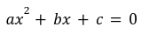
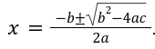

# U2PA01 — Inputs y Recortes

## Objetivo

Aplicar:

- entrada de datos con `input()`
- operaciones aritméticas
- uso de fórmulas matemáticas
- manejo de cadenas
- slicing y `.find()`
- formato de salida

---

# Ejercicio 1 — Resolver una ecuación cuadrática

Una ecuación cuadrática tiene la forma:



Las soluciones se calculan mediante:

 

## Requerimientos

Crear el archivo:

```text
ejercicio1.py
```

Solicitar al usuario:

```text
Ingrese el coeficiente a:
Ingrese el coeficiente b:
Ingrese el término independiente c:
```

Ejemplo:

```text
Ingrese el coeficiente a: 1
Ingrese el coeficiente b: -11
Ingrese el término independiente c: 24
x1: 8.00
x2: 3.00
```

## Restricciones

- Debe usar 3 instrucciones `input()`
- Mostrar las raíces con 2 decimales

---

# Ejercicio 2 — Resolver una ecuación cuadrática (b)

Crear el archivo:

```text
ejercicio2.py
```

Solicitar los coeficientes usando UNA SOLA instrucción `input()`.

Ejemplo:

```text
Ingrese los coeficientes a, b y c separados por espacios: 4 -12 5
x1: 2.50
x2: 0.50
```

## Restricciones

- NO usar `.split()`
- SOLO usar:
  - `.find()`
  - slicing
- Mostrar las raíces con 2 decimales

---

# Estructura esperada

```text
.
├── ejercicio1.py
├── ejercicio2.py
├── README.md
└── tests/
```

---

# Ejecución

## Ejercicio 1

```bash
python ejercicio1.py
```

## Ejercicio 2

```bash
python ejercicio2.py
```

---

# Entrega

La entrega se realiza mediante:

```bash
git add .
git commit -m "Entrega PA01"
git push
```

---

# IMPORTANTE — Commits obligatorios

Debe existir un mínimo de 3 commits:

1. Estructura inicial
2. Solución ejercicio 1
3. Solución ejercicio 2 y correcciones

Repositorios con un único commit podrán ser revisados manualmente.

---

# Evaluación automática

El sistema verificará automáticamente:

- ejecución correcta
- resultados matemáticos
- formato de salida
- precisión decimal
- prohibición de `.split()`
- errores de ejecución

---

# Recomendaciones

- Realice commits frecuentes
- Pruebe sus programas antes de subirlos
- Revise la pestaña:
  
```text
Actions
```

para verificar si las pruebas automáticas fueron aprobadas.

---

# Integridad académica

Debe comprender completamente su solución.

El profesor podrá solicitar sustentación individual del código desarrollado.

